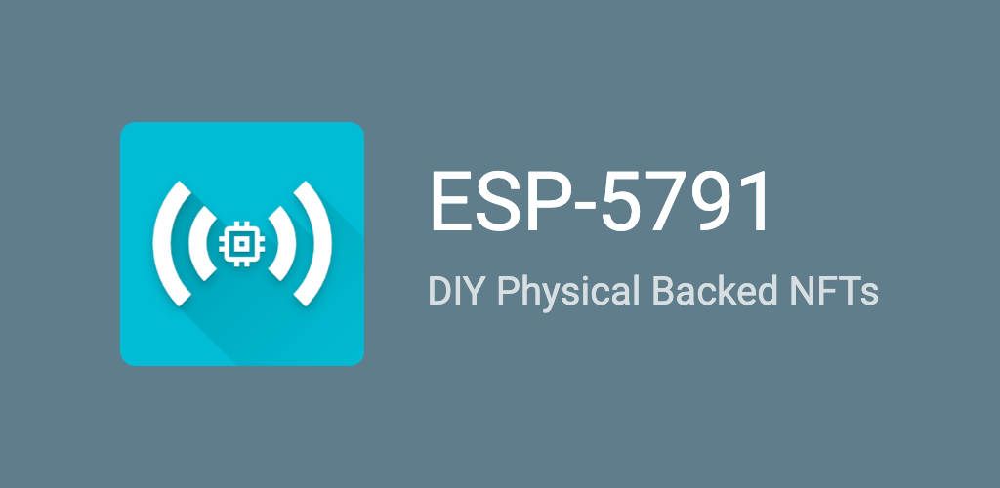

# ESP-5791



DIY Physical Backed NFTs ([EIP-5791](https://eips.ethereum.org/EIPS/eip-5791)) using ESP32 and BLE

## Motivation

The concept of _Physical Backed Tokens_ (PBTs) allows one to _bind a NFT permanently to a physical object_, using a small chip that can generate cryptographic keys and sign messages. The signature obtained from a device like this can be used to interact with a _smart contract_ to transfer the corresponding NFT to one's wallet.

Some folks smarter than me put together the specification for [EIP-5791](https://eips.ethereum.org/EIPS/eip-5791) on how to make this work both on the smart contract- and hardware-side, in a way that it's safe to use and no one involved in the process can cheat. As opposed to the few commercial solutions out there employing custom NFC chips, the [ESP32 microcontroller](https://wikipedia.org/wiki/ESP32) is freely available for everyone for ~$5-10 (probably even cheaper in bulk), with a wide selection of [different board designs](https://randomnerdtutorials.com/getting-started-with-esp32) and form factors. It comes with hardware flash-encryption and Bluetooth Low Energy, and is fully _Arduino IDE_-compatible, which makes it easy to get started with for almost everyone, and a viable candidate for both smaller scale PBT projects and learning about the technology to build more professional solutions.

## Key features

The _ESP-5791 project_ complies with the [EIP-5791 standard](https://eips.ethereum.org/EIPS/eip-5791) and facilitates

- creating a hardware device using an ESP32 microcontroller that
  - securely generates and stores private keys on first boot
  - exposes chip public keys and address via BLE to verify it's authenticity
  - signs messages sent via BLE using the stored private keys
- deploying a "PBT-enabled" NFT smart contract (ERC-721) to be used with the device
- interacting with both the device and the smart contract to transfer the NFT to the user's wallet

## Monorepo folder structure

- `Arduino` contains the microcontroller software and tweaked libraries to be used with Arduino IDE
- `hardhat` contains Solidity smart contracts implementing EIP-5791, based on the [PBT](https://github.com/chiru-labs/PBT) project
- `client` contains a browser based GUI to interact with the hardware using [Web Bluetooth API](https://developer.mozilla.org/en-US/docs/Web/API/Web_Bluetooth_API). Check out the [ESP-5791 GUI on Github Pages](https://xtools-at.github.io/esp5791).

---

## _Make_ a PBT - the hardware side

### Requirements

- [ESP32 Dev board](https://randomnerdtutorials.com/getting-started-with-esp32) + USB cable
  - supported chips: **v1** (ESP32, ESP32D, ESP32-S1, ...) and **v3** (ESP32-S3, ESP32-C3, ...) - _v2_ chips are Wifi-only
- [Arduino IDE](https://docs.arduino.cc/software/ide-v1) Desktop App to flash the device
- (for production use) [esptool.py](https://github.com/espressif/esptool) for encrypting the device

### Arduino IDE: Setup

- Go to `Tools > Board > Boards Manager`, search for and install **esp32** board definitions
- Symlink or copy libraries and sketch from the repo to the Arduino sketch folder

```bash
# example for symlinking on macOS
ln -s ~/path_to_repo/esp5791/Arduino/libraries/Web3E ~/Documents/Arduino/libraries/Web3E
ln -s ~/path_to_repo/esp5791/Arduino/libraries/NimBLE-Arduino ~/Documents/Arduino/libraries/NimBLE-Arduino
ln -s ~/path_to_repo/esp5791/Arduino/ESP5791 ~/Documents/Arduino/ESP5791
```

(Please use the libs included in the repo. You can find the original libs here for reference: [Web3E](https://github.com/AlphaWallet/Web3E) / [NimBLE](https://github.com/h2zero/NimBLE-Arduino))

### Arduino IDE: Flash software

- Connect ESP32 Dev board via USB, choose correct settings in `Tools > Board` and `Tools > Port` for your setup
  - there are some boards out there with cheapo USB controllers (CH340X / CH9102X) - if your board isn't picked up over USB at all, you might have to find and install additional USB drivers to make it work
- Click _Upload_ to compile and flash the software
  - Depending on your ESP32 board, you may have to hold down the _boot_ button while flashing or you'll get an error
- On first boot, the ESP32 securely generates a random private key itself, and stores it in flash memory

**If you're only experimenting, you're done here!** Connect your ESP-5791 to a power supply and start using the BLE interface. The next step encrypts the ESP32, which is irreversible and makes it impossible to flash new sketches going forward, so it's only relevant if you plan to use your board in production.

### esptool.py: encrypt and secure chip using eFuses (production ONLY)

!! Danger zone: this may brick your board and void your warranty !! changes done here are irreversible, thread carefully !! the author assumes no responsibility !!

These are the main steps involved to secure your ESP32 for production. Be aware that flash encryption on _v1_ chips [has been exploited before](https://limitedresults.com/2019/11/pwn-the-esp32-forever-flash-encryption-and-sec-boot-keys-extraction), use _v3_ only for production.

- Some [ESP32 eFuse basics](https://blog.espressif.com/understanding-esp32s-security-features-14483e465724) first
- Enabling [Flash encryption](https://docs.espressif.com/projects/esp-idf/en/latest/esp32/security/flash-encryption.html).
  - Also disable [UART ROM download mode](https://docs.espressif.com/projects/esp-idf/en/latest/esp32/security/flash-encryption.html#enabling-uart-bootloader-encryption-decryption) here permanently
  - Be aware of the differences between _Development_ vs. _Release_ modes, the latter is irreversible
- Enabling [Secure Boot V2](https://docs.espressif.com/projects/esp-idf/en/latest/esp32/security/secure-boot-v2.html). This also disables JTAG access

---

## _Use_ your PBT - the BLE interface

_ESP-5791_ comes with a BLE interface to obtain signatures from the device. The general workflow looks like this:

- Start a BLE scan, look for devices exposing a _[GATT](https://bluetoothle.wiki/gatt) service_ with the UUID `0x5791`
- Connect to the device (pairing not necessary; only one device can be connected at a time)
- The service exposes the following _GATT characteristics_:
  - `0xA001` let's you _read_ the device's **public key**
  - `0xA002` let's you _read_ the device's **wallet address**
  - _write_ a **plaintext message** to `0xB001` or a **keccak256-hashed message** to `0xB002` for the device to sign
  - _read_ the **signature** from `0xC001`. `0xC002` returns the hash of the corresponding prefixed [Ethereum signed message](https://eips.ethereum.org/EIPS/eip-191), `0xC008` gives you the keccak256-hash of the original plaintext message.

You can use the [ESP-5791 GUI on Github Pages](https://xtools-at.github.io/esp5791) to interact with your device (source can be found in the `client` folder), or an app like _nRF Connect_ ([mobile](https://www.nordicsemi.com/Products/Development-tools/nrf-connect-for-mobile)/[desktop](https://www.nordicsemi.com/Products/Development-tools/nRF-Connect-for-desktop)) for more generic testing and debugging.

### Signing a message for the PBT smart contract

The message you have to sign on your device for the provided EIP-5791 **PBT smart contract** consists of

- your wallet address (e.g. _0xd8dA6BF26964aF9D7eEd9e03E53415D37aA96045_)
- the blockhash of a **recent** block (e.g. _0x9ad2aa4bdfea57c247ef4202f08b5dec795fa6fb04f94773222b22d18199d9c7_)
  - look up e.g. on [Etherscan](https://etherscan.io), note down the corresponding block **number** too (our GUI takes care of this for you)

You need to concatenate both these hex strings before signing them. In a simplified scenario, if your wallet would e.g. be _0x42069_ and the blockhash of block #777 is _0xBBBBB_, then your message to sign should look like this: `0x42069BBBBB`. After obtaining the _signature_ from the device, you can call the smart contract like this: `ESP5791.transferTokenWithChip(mySignatureHexString = 0x..., blockNumberUsedInSig = 777)` to claim the connected NFT. Generated signatures expire within 250 blocks.

### Customizing the GUI

To edit the provided GUI, you'll need to run a server locally, as MetaMask and other wallets don't work locally (i.e. using `file://` protocol). To quickly spin up a dev server, you could use

```bash
# install server
npm i -g http-server
# go to public web directory
cd ./client
# start dev server on http://localhost:8080
npx http-server
```

---

## _Deploy_ your PBT - the smart contract

This package includes a ready-to-deploy PBT contract based on [Chiru Labs' PBT implementation](https://github.com/chiru-labs/PBT) and [OpenZeppelin's ERC721 NFT contracts](https://github.com/OpenZeppelin/openzeppelin-contracts) with additional management capabilities. Also check out our [demo contract on Etherscan](https://goerli.etherscan.io/token/0xfad7eab70ed7569aa54afd7b11bb376d948b2665).

The general interaction flow looks like this:

- deploy token contract
- setup _chip address to token id_ mapping using `seedChipToTokenMapping(address[] chipAddresses, uint256[] tokenIds)`
- transfer or mint a token with a chip signature using `transferTokenWithChip(bytes signatureFromChip, uint256 blockNumberUsedInSig)`

### Token deployment and management

- switch to `hardhat` directory: `cd hardhat`
- install dependencies: `yarn`
- copy `.env.example` to `.env` and put your own values in
- compile contracts: `yarn compile` or `npx hardhat compile`
- deploy token contract:
  `npx hardhat deploy --network goerli --name "My Token" --symbol "ABC" --uri "https://example.com/path-to-token-metadata/"`
  - if you've changed the contract name, you also need to pass in `--contract MyCustomContract`
  - use your desired network instead of `goerli`. Check `hardhat.config.ts` for all available network keys
- (recommended) verify contract source code on Etherscan:
  `npx hardhat verify --network goerli YOUR_CONTRACT_ADDRESS "My Token" "ABC" "https://example.com/path-to-token-metadata/"`
  - you need to use the _exact_ same input as when deploying here
- setup _chip address to token id_ mapping:
  `npx hardhat seed --network goerli --address YOUR_CONTRACT_ADDRESS --chips "0x123,0x234" --tokenids "1,2"`
- additional commands to manage the token contract:
  - transfer or mint a token using a chip signature: `npx hardhat transfer --network goerli --address YOUR_CONTRACT_ADDRESS --signature 0xABC --block 42069`
  - get token mapping data for a given chip address: `npx hardhat token --network goerli --address YOUR_CONTRACT_ADDRESS --chip 0x123`
  - add new admin wallet to token contract:
    `npx hardhat admin --network goerli --address YOUR_CONTRACT_ADDRESS --admin 0x777`
  - update token metadata uri:
    `npx hardhat uri --network goerli --address YOUR_CONTRACT_ADDRESS --uri "https://example.com/new-path-to-metadata/"`
  - replace existing defective chips:
    `npx hardhat update --network goerli --address YOUR_CONTRACT_ADDRESS --oldchips "0x123,0x234" --newchips "0x888,0x999"`

### Token metadata

This repo does _not_ include packages to generate public **token metadata** or provide respective endpoints for your ERC721 PBT. You can find some inspiration on in my research repo for interactive NFTs [snakes-on-a-chain](https://github.com/deptagency/snakes-on-a-chain), or just make your metadata available as JSON files on a static file host or IPFS. See [here](https://docs.opensea.io/docs/metadata-standards) on more details on the structure of NFT metadata.

### Notes

Hardhat dev environment based on [PaulRBerg's Hardhat Template](https://github.com/paulrberg/hardhat-template), refer to
that repo's README for specific questions on how to use the tools.

---

## Thanks to

- The authors of [EIP-5791](https://eips.ethereum.org/EIPS/eip-5791)
- [Chiru Labs](https://github.com/chiru-labs) for the [PBT](https://github.com/chiru-labs/PBT) smart contract reference implementation
- [Espressif Systems](https://github.com/espressif) for the ESP :)
- [Firefly Wallet](https://github.com/firefly/wallet) for the inspiration
- [AlphaWallet](https://github.com/AlphaWallet) for the [Web3E](https://github.com/AlphaWallet/Web3E) ESP32 Ethereum lib (includes the [trezor-crypto](https://github.com/trezor/trezor-firmware/tree/master/crypto) lib)
- [Mbed TLS](https://github.com/Mbed-TLS/mbedtls) (cryptographic lib for embedded systems)
- [NimBLE](https://github.com/h2zero/NimBLE-Arduino) (lightweight BLE lib for Arduino/ESP32)

## License

MIT

Copyright © 2023 [xtools-at](https://github.com/xtools-at)

## Disclaimer

> THE SOFTWARE IS PROVIDED "AS IS", WITHOUT WARRANTY OF ANY KIND, EXPRESS OR IMPLIED, INCLUDING BUT NOT LIMITED TO THE WARRANTIES OF MERCHANTABILITY, FITNESS FOR A PARTICULAR PURPOSE AND NONINFRINGEMENT. IN NO EVENT SHALL THE AUTHORS OR COPYRIGHT HOLDERS BE LIABLE FOR ANY CLAIM, DAMAGES OR OTHER LIABILITY, WHETHER IN AN ACTION OF CONTRACT, TORT OR OTHERWISE, ARISING FROM, OUT OF OR IN CONNECTION WITH THE SOFTWARE OR THE USE OR OTHER DEALINGS IN THE SOFTWARE.
